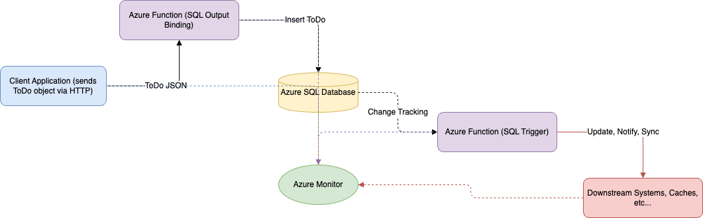

# Azure Functions with SQL Triggers and Bindings (TypeScript)

An Azure Functions QuickStart project that demonstrates how to use both SQL Triggers and SQL Output Bindings with the Azure Developer CLI (azd) for rapid, event-driven integration with Azure SQL Database.

## Architecture



This architecture shows how Azure Functions can both write to and react to changes in an Azure SQL Database using output bindings and triggers. The key components include:

- **Client Applications**: Send HTTP requests to the Azure Function
- **Azure Function with SQL Output Binding**: Receives HTTP requests and writes data to SQL Database
- **Azure Function with SQL Trigger**: Reacts to changes in SQL Database tables
- **Azure SQL Database**: Stores ToDo items
- **Azure Monitor**: Provides logging and metrics for the function execution

This serverless architecture enables scalable, event-driven data ingestion and processing with minimal code.

## Top Use Cases

### SQL Output Binding
1. **Data Ingestion API**: Quickly create APIs that write data to SQL Database without custom data access code.
2. **Serverless CRUD Operations**: Build serverless endpoints for line-of-business apps that interact with SQL data.

### SQL Trigger
1. **Change Data Capture & Auditing**: Automatically react to inserts, updates, or deletes in your SQL tables for auditing, notifications, or downstream processing.
2. **Event-Driven Workflows**: Trigger business logic or integration with other services when data changes in SQL, such as updating caches, sending alerts, or synchronizing systems.

## Features

* SQL Output Binding
* SQL Trigger
* TypeScript v4 programming model with Node.js 22.x
* Azure Functions Flex Consumption plan
* Azure Developer CLI (azd) integration for easy deployment
* Infrastructure as Code using Bicep templates

## Getting Started

### Prerequisites

- [Node.js 22.x](https://nodejs.org/) or later
- [Azure Functions Core Tools](https://docs.microsoft.com/azure/azure-functions/functions-run-local#install-the-azure-functions-core-tools)
- [Azure Developer CLI (azd)](https://docs.microsoft.com/azure/developer/azure-developer-cli/install-azd)
- An Azure subscription

### Quickstart

1. Clone this repository
   ```bash
   git clone https://github.com/Azure-Samples/functions-quickstart-typescript-azd-sql.git
   cd functions-quickstart-typescript-azd-sql
   ```

2. Install dependencies
   ```bash
   npm install
   ```

3. Build the TypeScript code
   ```bash
   npm run build
   ```

4. Provision Azure resources using azd
   ```bash
   azd provision
   ```
   This will create all necessary Azure resources including:
   - Azure SQL Database (default name: ToDo)
   - Azure Function App
   - App Service Plan
   - Other supporting resources
   - local.settings.json for local development with Azure Functions Core Tools, which should look like this:
   ```json
   {
     "IsEncrypted": false,
     "Values": {
       "AzureWebJobsStorage": "UseDevelopmentStorage=true",
       "FUNCTIONS_WORKER_RUNTIME": "node",
       "WEBSITE_SITE_NAME": "ToDo-local",
       "AZURE_SQL_CONNECTION_STRING_KEY": "Server=..."
     }
   }
   ```

5. Deploy the application code to Azure
   ```bash
   azd deploy
   ```

6. Test the deployed function by sending a POST request to the Azure Function endpoint (see Azure Portal for the URL).

## Understanding the Functions

### HTTP Trigger with SQL Output Binding

**File**: `src/functions/httpTriggerSqlOutput.ts`

This function demonstrates how to use an HTTP trigger to receive data and write it to Azure SQL Database using an output binding.

- **Trigger**: HTTP POST request
- **Input**: ToDoItem JSON object in request body
- **Output**: Same ToDoItem written to `dbo.ToDo` table in SQL Database
- **Response**: Returns the created ToDoItem with HTTP 200 status

### SQL Trigger

**File**: `src/functions/sqlTriggerToDo.ts`

This function demonstrates how to react to changes (inserts, updates, deletes) in the SQL Database table.

- **Trigger**: Changes to `dbo.ToDo` table
- **Processing**: Logs details about each change operation
- **Use cases**: Auditing, notifications, downstream processing

## Local Development

1. Start the Azurite storage emulator (required for local development)
   ```bash
   azurite --silent --location c:\azurite --debug c:\azurite\debug.log
   ```

2. Start the function app locally
   ```bash
   npm run start
   ```

3. Test the HTTP trigger function using the test file:
   ```bash
   # The function will be available at:
   # POST http://localhost:7071/api/httpTriggerSqlOutput
   ```

## Monitoring and Logs

The functions include Application Insights integration for monitoring and logging. You can view:

- Function execution logs
- Performance metrics
- Error tracking
- Custom telemetry

Access logs through:
- Azure Portal > Function App > Monitor
- Application Insights resource
- Azure Monitor Logs

## SQL Trigger Testing

To test the SQL trigger function:

1. Ensure the function app is running (locally or in Azure)
2. Insert, update, or delete records in the `dbo.ToDo` table
3. Observe the logs to see the trigger function executing

Example SQL to trigger the function:
```sql
INSERT INTO dbo.ToDo (id, title, url, completed) 
VALUES (NEWID(), 'Test Item', 'https://example.com', 0);
```

## Resources

- [Azure Functions SQL Bindings & Triggers Documentation (Microsoft Learn)](https://learn.microsoft.com/en-us/azure/azure-functions/functions-bindings-azure-sql?tabs=isolated-process%2Cextensionv4&pivots=programming-language-javascript)
- [Azure Functions Documentation](https://docs.microsoft.com/azure/azure-functions/)
- [Azure SQL Database Documentation](https://docs.microsoft.com/azure/azure-sql/)
- [Azure Developer CLI Documentation](https://docs.microsoft.com/azure/developer/azure-developer-cli/install-azd/)
- [TypeScript Azure Functions Programming Model v4](https://docs.microsoft.com/azure/azure-functions/functions-reference-node)